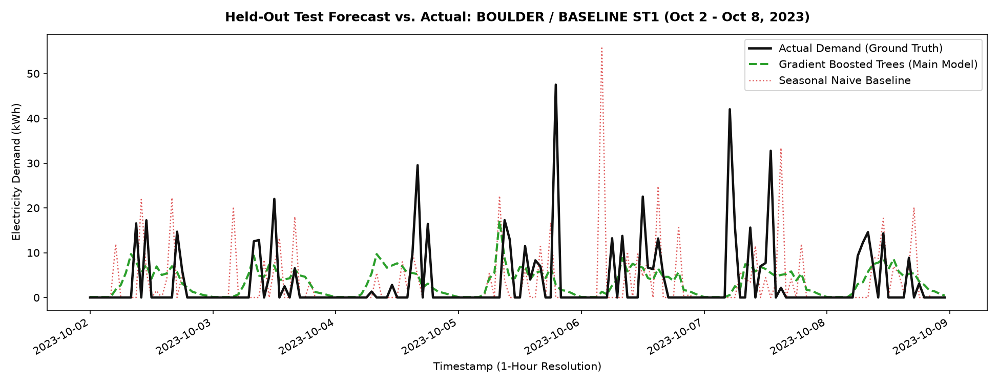
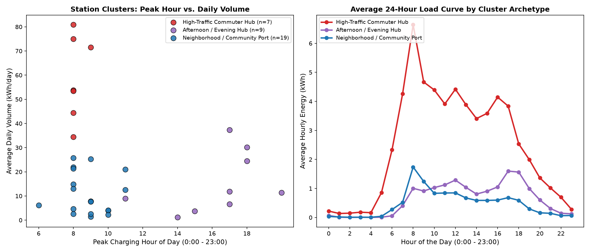
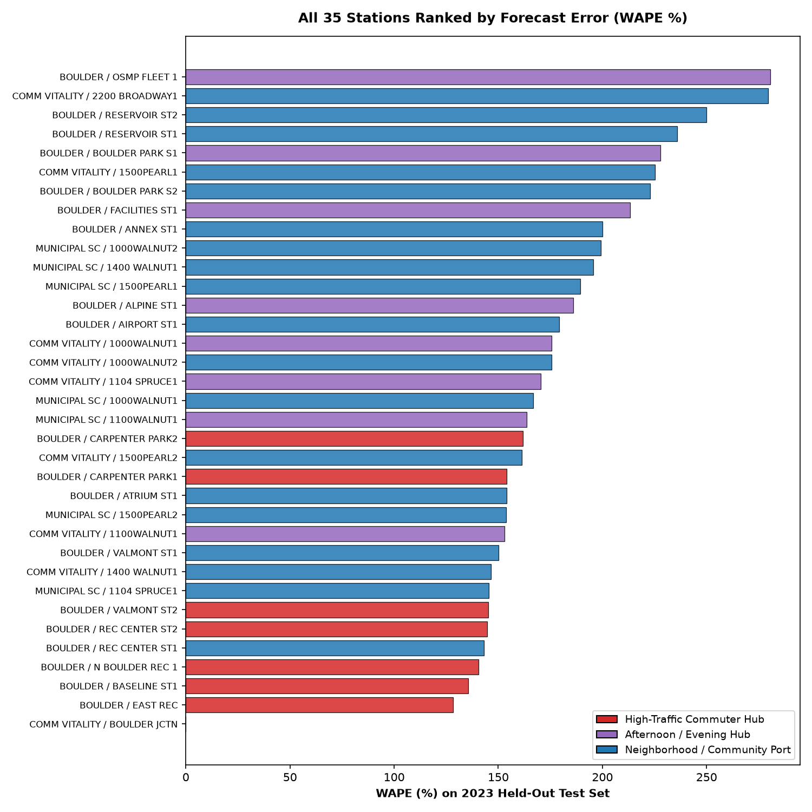

# Multi-Site Electric Vehicle Demand Forecasting

[](https://www.python.org/)
[](https://scikit-learn.org/)
[](LICENSE)
[]()
[](https://open-data.bouldercolorado.gov/datasets/cityofboulder::electric-vehicle-charging-station-data/about)

An end-to-end machine learning pipeline for regularizing, profiling, and forecasting hourly electricity demand across 35 municipal Electric Vehicle (EV) charging stations in the City of Boulder, Colorado.

The pipeline transforms raw, uncoordinated transaction logs into a continuous Cartesian time-series grid (919,800 hourly observations), segments charging stations into behavioral archetypes, benchmarks multi-tier predictive models under expanding walk-forward validation, and generates structured executive briefings via the Google Gemini API.

---

## Visual Pipeline & Results

<p align="center">
  
</p>

*Figure 1: 7-day out-of-sample forecast vs. actual demand across high-demand commuter stations. The gradient boosted tree model captures diurnal spikes while suppressing false baseline load.*

<p align="center">
  
</p>

*Figure 2: K-Means clustering (K=3) in 4D behavioral feature space and 2D PCA projection, categorizing stations into Commuter Hubs, Afternoon Destinations, and Neighborhood Ports.*

---

## Executive Overview

Municipal EV charging networks present a core operational challenge: **extreme demand intermittency**. Unlike aggregate utility-scale electricity demand, individual public chargers sit idle for long durations, punctuated by sharp, unscheduled charging sessions.

* **Sparsity:** 95.2% of all station-hours register zero energy delivery (0.0 kWh).
* **Metric Failure:** Classical percentage error metrics such as Mean Absolute Percentage Error (MAPE) divide by zero and fail on intermittent data.
* **Heterogeneity:** Stations exhibit divergent demand behavior based on urban zoning, from morning commuter lots to evening commercial districts and quiet recreational ports.

This project implements an empirical solution to multi-site load forecasting under high zero-inflation, establishing an open benchmark comparing seasonal baselines, regularized linear models, and Poisson-loss gradient boosted trees.

---

## Pipeline Architecture

```
Raw Transaction Logs (148k+ events, 2021-2023)
                      |
                      v
[ 01_clean_data.py ] -> Continuous Cartesian Grid (35 stations x 26,280 hours = 919,800 rows)
                      |
                      v
[ 02_eda.py ] --------> Diurnal profiles, weekday/weekend splits, growth trends, sparsity analysis
                      |
                      v
[ 03_cluster_stations.py ] -> 4D Behavioral Fingerprints & Standardized K-Means (K=3)
                      |
                      v
[ 04_forecast_models.py ] --> 3-Fold Expanding Walk-Forward Validation (458,000+ test hours)
                               * Tier 1: Seasonal Naive Baseline (t-168)
                               * Tier 2: Ridge Regression (L2 regularization)
                               * Tier 3: Poisson Gradient Boosted Trees (Primary Model)
                      |
                      v
[ 05_evaluate.py ] ---------> Model residual evaluation & station error rankings
                      |
                      v
[ 06_llm_report.py ] -------> Automated analytical synthesis via Google Gemini API
                               * Executive Briefing exported to reports/EXECUTIVE_SUMMARY.md
```

---

## Benchmark Results

Models were evaluated using 3-fold expanding window **Walk-Forward Validation**, simulating chronological out-of-sample forecasting across 458,000+ test hours:

| Model Tier | Algorithm | RMSE (kWh) | MAE (kWh) | WAPE (%) | Description |
| :--- | :--- | :---: | :---: | :---: | :--- |
| **Tier 3** | **Gradient Boosted Trees (Primary)** | **5.515** | **1.524** | **154.10%** | Non-linear tree splits with Poisson deviance loss, multi-hour lags (`t-1..t-4`, `t-24`, `t-168`), rolling momentum, and cluster features |
| Tier 2 | Ridge Regression | 5.581 | 1.692 | 170.45% | Linear feature combinations with L2 regularization penalty |
| Tier 1 | Seasonal Naive Baseline | 7.517 | 1.648 | 165.78% | Persistence baseline copying identical hour from previous week (`t-168`) |

> **Key Takeaway:** The primary Gradient Boosted Tree model improves WAPE by 7.0% relative to the seasonal baseline and reduces RMSE by 26.6%, with the largest performance gains coming from reducing large peak-demand forecast errors.

<p align="center">
  
</p>

*Figure 3: Out-of-sample forecast error distribution (WAPE %) across all 35 charging sites.*

### Key Findings

1. **26.6% Reduction in Peak Forecast Error:** Gradient Boosted Trees reduced Root Mean Squared Error (RMSE) from **7.517 kWh down to 5.515 kWh** over the Seasonal Naive baseline. Because RMSE squares errors before averaging, this lower RMSE reflects substantially fewer large forecast errors, which is particularly critical for peak-demand planning and infrastructure capacity estimation.
2. **Quantifiable Value Over Heuristics:** The tree model delivers an **11.68 percentage point improvement** in WAPE over the Seasonal Naive baseline (a 7.0% relative improvement in total load allocation).
3. **Failure of Standard Linear Regression:** Ridge Regression exhibited the highest overall WAPE (170.45%). Under extreme zero-inflation, linear models apply an unconstrained continuous shift that predicts fractional "background buzz" across thousands of genuinely idle hours, accumulating substantial total absolute error.

> **Note on WAPE in Intermittent Demand:**  
> In continuous time-series where 95.2% of station-hours have zero demand (0.0 kWh), predicting even small fractional demand (e.g. 0.3 kWh) across thousands of idle hours accumulates absolute errors in the numerator, while the denominator contains only the concentrated positive volume of active charging sessions. Consequently, WAPE values exceeding 100% are expected and well-documented in intermittent demand literature (*Syntetos & Boylan, 2005*). For this reason, relative benchmark improvement and peak-error reduction (RMSE) are the primary indicators of operational value.

---

## Core Methodology & Engineering Decisions

### 1. Cartesian Grid Regularization & Zero Imputation
Raw EV transaction logs record event-based timestamps (plug-in and disconnect times). To enable valid time-series forecasting with stationary lag steps (`t-1`, `t-24`, `t-168`), we construct a complete Cartesian product:
$$\text{Total Observations} = 35 \text{ stations} \times 26,280 \text{ hours} = 919,800 \text{ rows}$$
All station-hours lacking active charging sessions are explicitly imputed with `0.0 kWh`.

### 2. Metric Selection: WAPE over MAPE
Given 95.2% zero values, classical MAPE:
$$\text{MAPE} = \frac{1}{N}\sum \left|\frac{y - \hat{y}}{y}\right|$$
is undefined due to division by zero. Adding arbitrary constants ($\epsilon$) artificially skews scores based on the chosen epsilon scale. We utilize Weighted Absolute Percentage Error (WAPE):
$$\text{WAPE} = \frac{\sum_{i=1}^{N} |y_i - \hat{y}_i|}{\sum_{i=1}^{N} y_i}$$
WAPE weights errors proportionally by actual delivered energy, prioritizing high-load peak hours over quiet overnight intervals.

### 3. Poisson Deviance Loss Function
To address non-negativity constraints and severe intermittency, Tier 3 Gradient Boosted Trees utilize a Poisson deviance loss:
$$\text{Loss}(y, \hat{y}) = 2 \left( y \log \frac{y}{\hat{y}} - y + \hat{y} \right)$$
When actual demand is zero ($y=0$), the loss simplifies to $2\hat{y}$. This introduces an asymmetric penalty that directly suppresses false-positive predictions during quiet hours, mitigating phantom baseline load.

### 4. Station Behavioral Profiling & K-Means Clustering
Stations were mapped into a 4-dimensional normalized feature space (`daily_volume_kwh`, `weekday_share`, `peak_hour`, `load_factor`). Using standardized K-Means ($K=3$), three distinct operating archetypes were identified:
* **High-Traffic Commuter Hubs (7 stations):** ~59.1 kWh/day average, sharp 8:00 AM arrival peak, accounts for over 54% of total municipal load (167.8 MWh in 2023). Most predictable archetype (**142.89% WAPE**).
* **Afternoon / Evening Hubs (9 stations):** ~15.1 kWh/day average, distinct 4:00 PM peak corresponding to commercial and recreational departures (**181.99% WAPE**).
* **Neighborhood / Community Ports (19 stations):** ~10.9 kWh/day average, dispersed low-utilization chargers with intermittent patterns (**165.69% WAPE**).

---

## Automated Analytical Reporting

The pipeline includes an analytical synthesis layer (`src/06_llm_report.py`) that consumes pipeline artifacts (validation metrics, archetype statistics, station error rankings) and generates an executive briefing via the Google Gemini API (model `gemini-3.8-flash`).

The briefing translates quantitative metrics into potential operational considerations, such as identifying candidates for localized Battery Energy Storage Systems (BESS) and Time-of-Use (TOU) tariff incentives for evening peak management. The generated report is exported to [`reports/EXECUTIVE_SUMMARY.md`](reports/EXECUTIVE_SUMMARY.md).

---

## Project Structure

```
Multi-Site-Demand-Forecasting/
├── data/
│   ├── raw/                           # Raw Boulder transaction CSVs (git-ignored)
│   └── processed/
│       └── station_clusters.csv       # Station cluster metadata and archetypes
├── reports/
│   ├── figures/                       # Visualizations generated by pipeline
│   │   ├── 01_diurnal_hourly_profile.png
│   │   ├── 02_weekday_vs_weekend.png
│   │   ├── 03_monthly_trend_growth.png
│   │   ├── 04_station_demand_disparity.png
│   │   ├── 05_station_clusters.png
│   │   ├── 06_forecast_vs_actual.png
│   │   ├── 07_residual_analysis.png
│   │   └── 08_station_error_rankings.png
│   ├── benchmark_results.csv          # Walk-forward model scorecard
│   ├── station_performance.csv        # 35-station accuracy rankings
│   └── EXECUTIVE_SUMMARY.md           # LLM-generated operational brief
├── src/
│   ├── 01_clean_data.py               # Ingestion and Cartesian hourly resampling
│   ├── 02_eda.py                      # Exploratory data analysis suite
│   ├── 03_cluster_stations.py         # K-Means behavioral clustering
│   ├── 04_forecast_models.py          # Multi-tier walk-forward benchmark
│   ├── 05_evaluate.py                 # Out-of-sample diagnostics & residual analysis
│   └── 06_llm_report.py               # Automated AI executive briefing generator
├── .env.example                       # Template for API configuration
├── .gitignore                         # Data and secret exclusion rules
├── LICENSE                            # MIT License
├── README.md                          # Project documentation
└── requirements.txt                   # Dependency specifications
```

---

## Getting Started

### Prerequisites

* Python 3.9 or higher
* Recommended environment: Virtual environment (`venv` or `conda`)

### Installation

```bash
# Clone the repository
git clone https://github.com/arunabh2005/Multi-Site-Demand-Forecasting.git
cd Multi-Site-Demand-Forecasting

# Create and activate a virtual environment
python -m venv venv
# On Windows:
venv\Scripts\activate
# On Linux/macOS:
source venv/bin/activate

# Install dependencies
pip install -r requirements.txt
```

### Configuration

Copy `.env.example` to `.env` to enable live LLM report generation (optional):

```bash
# Set your Gemini API key (free tier supported)
GEMINI_API_KEY=your_gemini_api_key_here
```

*Note: If no API key is provided, `src/06_llm_report.py` runs in local deterministic fallback mode using pre-computed analytical templates.*

### Running the Pipeline

Execute each pipeline stage sequentially:

```bash
# Step 1: Regularize transaction logs into a continuous hourly grid
python src/01_clean_data.py

# Step 2: Generate exploratory visualizations and sparsity analysis
python src/02_eda.py

# Step 3: Cluster stations into behavioral archetypes
python src/03_cluster_stations.py

# Step 4: Run expanding walk-forward multi-tier model benchmark
python src/04_forecast_models.py

# Step 5: Run model diagnostics and station rankings
python src/05_evaluate.py

# Step 6: Generate executive summary brief
python src/06_llm_report.py
```

---

## References & Acknowledgments

* **City of Boulder Open Data Portal**: *Electric Vehicle Charging Station Data*, City of Boulder, Colorado ([Dataset Link](https://open-data.bouldercolorado.gov/datasets/cityofboulder::electric-vehicle-charging-station-data/about)).
* **Intermittent Demand & Forecast Metric Literature**:
  * Syntetos, A. A., & Boylan, J. E. (2005). *The accuracy of intermittent demand estimates*. International Journal of Forecasting, 21(2), 303-314.
  * Hyndman, R. J., & Koehler, A. B. (2006). *Another look at measures of forecast accuracy*. International Journal of Forecasting, 22(4), 679-688.
* **Poisson Regression & Gradient Boosting**:
  * Nelder, J. A., & Wedderburn, R. W. (1972). *Generalized Linear Models*. Journal of the Royal Statistical Society: Series A (General), 135(3), 370-384.
  * Friedman, J. H. (2001). *Greedy function approximation: A gradient boosting machine*. Annals of Statistics, 29(5), 1189-1232.

---

## Author

**Arunabh Das** ([LinkedIn](https://www.linkedin.com/in/arunabh-das-ba9a1725b/))
